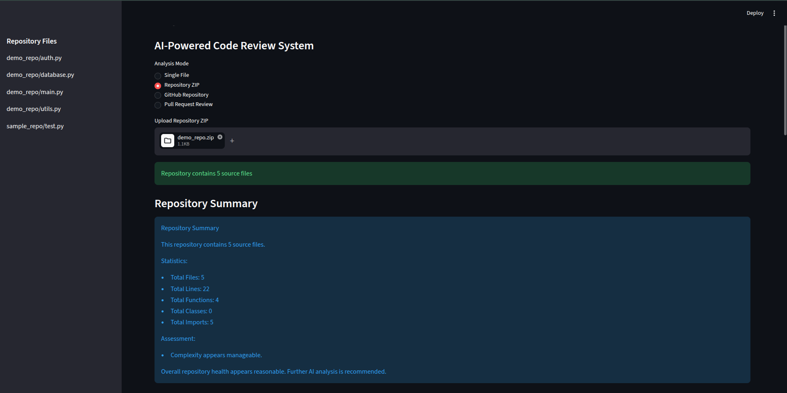
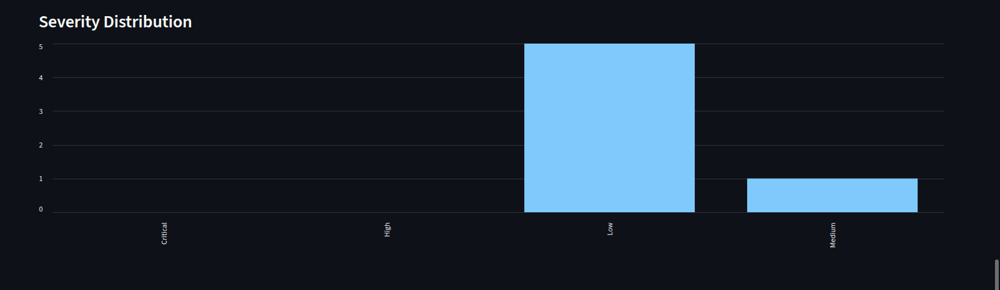
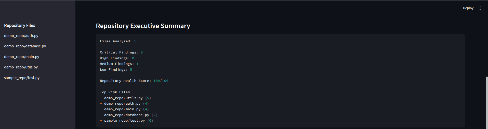
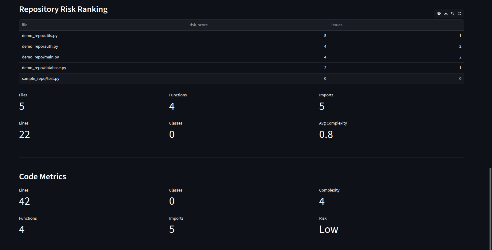
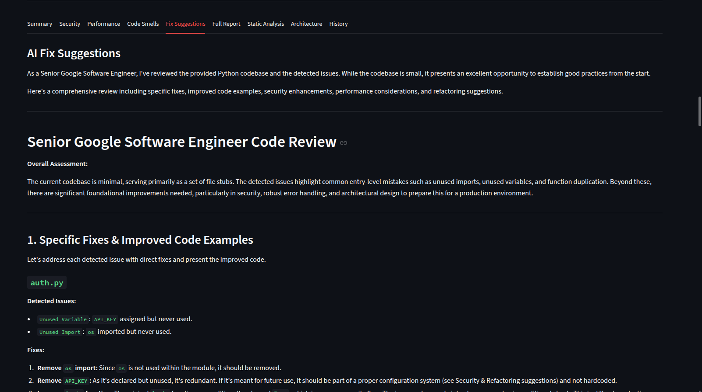

# IntelliReview AI

IntelliReview AI is an AI-powered Software Engineering Intelligence Platform that helps developers understand, evaluate, and improve code quality across entire repositories.

The system combines static analysis, repository metrics, architecture analysis, risk scoring, and Large Language Models (Gemini) to generate actionable code review reports and remediation suggestions.

---

# Features

## Code Analysis

* Single File Analysis
* Repository ZIP Analysis
* GitHub Repository Analysis
* Pull Request Review

## Static Analysis

* Hardcoded Secret Detection
* Unused Import Detection
* Unused Variable Detection
* Duplicate Function Detection
* Dead Function Detection
* Complexity Analysis
* Code Smell Detection

## Repository Analysis

* Repository Health Score
* Architecture Analysis
* Architecture Score
* Risk Ranking
* Repository Executive Summary

## AI Features

* Gemini-Powered Code Reviews
* AI Fix Suggestions
* Automated Recommendations
* Executive Summaries

## Reporting

* Severity Dashboard
* Historical Comparison
* PDF Report Generation
* Repository Insights

---

# Screenshots

## Landing Page



## Severity Dashboard



## Executive Summary



## Repository Risk Ranking



## AI Fix Suggestions



---

# Architecture

```text
User Input
    |
    v
Streamlit UI
    |
    v
Static Analysis Engine
    |
    +---- Security Analysis
    |
    +---- Repository Analysis
    |
    +---- Architecture Analysis
    |
    v
Gemini Review Engine
    |
    v
AI Fix Suggestions
    |
    v
Executive Summary & Reports
```

---

# Tech Stack

### Frontend

* Streamlit

### Backend

* Python

### AI

* Google Gemini 2.5 Flash

### Analysis

* AST
* Static Analysis
* Repository Metrics
* Risk Scoring

### Reporting

* PDF Generation
* Charts & Dashboards

---

# Installation

Clone the repository:

```bash
git clone https://github.com/yourusername/intellireview-ai.git
cd intellireview-ai
```

Create a virtual environment:

```bash
python -m venv venv
source venv/bin/activate
```

Install dependencies:

```bash
pip install -r requirements.txt
```

Create a `.env` file:

```env
GEMINI_API_KEY=YOUR_API_KEY
```

Run the application:

```bash
streamlit run app.py
```

---

# Usage

### Single File Analysis

Upload a Python, Java, C++, or JavaScript file and receive:

* Static Analysis
* Security Review
* AI Review
* Fix Suggestions

### Repository Analysis

Upload a repository ZIP file to receive:

* Repository Health Score
* Architecture Analysis
* Risk Ranking
* Executive Summary

### Pull Request Review

Paste a pull request diff and receive:

* Severity Classification
* Security Findings
* AI Recommendations

---

# Project Structure

```text
intellireview-ai/
│
├── analyzer/
├── tests/
├── assets/
├── uploads/
├── app.py
├── requirements.txt
├── README.md
└── .gitignore
```

---

# Future Improvements

* Real-Time GitHub Webhook Integration
* Multi-Language Support Expansion
* Trend Analysis Dashboard
* Repository Benchmarking
* CI/CD Integration
* Team Collaboration Features

---


