# IntelliReview AI

<p align="center">
  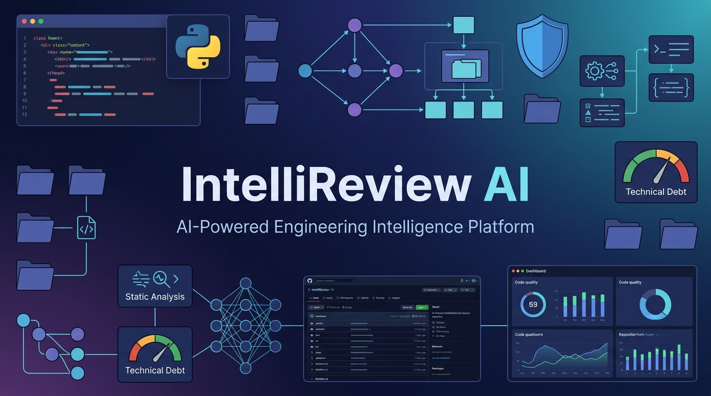
</p>

<h1 align="center">
🔍 IntelliReview AI
</h1>

<p align="center">
<b>AI-Powered Engineering Intelligence Platform</b>
</p>

<p align="center">
Analyze source code, repositories, and pull requests using AI, static analysis, architecture intelligence, security analysis, dependency visualization, and engineering metrics.
</p>

<p align="center">


</p>

---

## 🎥 Demo

> **Demo video will be embedded here after uploading to GitHub.**

---

# 🎯 Overview

IntelliReview AI is built around a modular Engineering Intelligence Engine composed of specialized analysis modules. Each module evaluates a distinct aspect of repository quality and produces structured insights that are combined into comprehensive engineering reports, dashboards, and AI-assisted recommendations.

Unlike traditional code review tools that focus primarily on linting or static analysis, IntelliReview AI combines multiple engineering analysis modules into a unified platform capable of evaluating repository architecture, maintainability, security, technical debt, dependencies, and overall engineering quality.

The platform combines deterministic static analysis with Google Gemini AI to generate engineering reviews, executive summaries, repository intelligence, actionable recommendations, and professional reports.

---


# Supported Analysis Modes

IntelliReview AI currently supports four independent workflows:

| Analysis Mode | Description |
|---------------|-------------|
| 📄 Single File Analysis | Review an individual source code file using AI and static analysis |
| 📦 Repository ZIP Analysis | Analyze an uploaded repository archive |
| 🌐 GitHub Repository Analysis | Clone and analyze public GitHub repositories |
| 🔀 Pull Request Review | Review pull request diffs before merging |

---

# Why IntelliReview AI?

Modern software systems require much more than syntax checking.

IntelliReview AI evaluates code from multiple engineering perspectives, including:

- AI-Powered Code Review
- Repository Health Assessment
- Static Code Analysis
- Security Vulnerability Detection
- Software Architecture Analysis
- Dependency Graph Generation
- Technical Debt Evaluation
- Complexity Analysis
- Module Risk Ranking
- Root Cause Analysis
- Refactoring Prioritization
- Executive Report Generation

The goal is to provide developers with actionable engineering intelligence instead of isolated warnings.

---

# 🎯 Vision

The long-term vision of IntelliReview AI is to evolve from an AI-assisted code review tool into a production-quality Engineering Intelligence Platform capable of performing repository-wide software engineering analysis and generating actionable engineering insights.

The platform is designed to combine static analysis, architecture evaluation, repository intelligence, AI-assisted reasoning, and professional reporting into a unified developer experience.

---

# Key Highlights

- Multi-mode code analysis platform
- AI-assisted engineering insights using Google Gemini
- Repository-wide static analysis
- Software architecture evaluation
- Dependency visualization
- Technical debt measurement
- Repository health scoring
- Security issue detection
- Complexity heatmap generation
- Executive summary generation
- PDF and TXT report export
- Interactive Streamlit dashboard
---

# ✨ Features

<p align="center">
    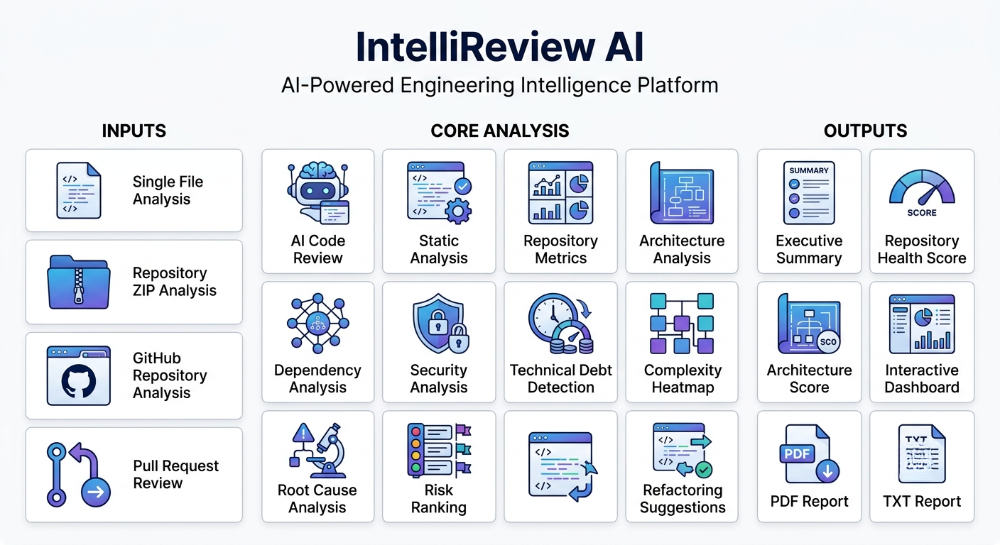
</p>

IntelliReview AI combines AI-assisted code review with repository-wide engineering analysis to provide a comprehensive understanding of software quality, maintainability, security, and architecture.

---

# 🧠 Engineering Intelligence Engine

IntelliReview AI is powered by a collection of specialized analysis engines, each responsible for evaluating a different aspect of repository quality. Together, these engines provide comprehensive engineering intelligence across the entire codebase.

| Engine | Purpose |
|---------|---------|
| 🧩 AST Analyzer | Performs AST-based static analysis to detect code quality issues, complexity, dead code, and engineering rule violations. |
| 📂 Repository Analyzer | Coordinates repository-wide analysis by aggregating results from all analysis engines. |
| 🏗 Architecture Analyzer | Evaluates repository structure, module organization, and architectural quality. |
| 📊 Repository Metrics Engine | Computes repository-wide engineering metrics including LOC, complexity, imports, and structural statistics. |
| ⚙ Technical Debt Engine | Estimates technical debt based on static analysis findings and engineering metrics. |
| 🔒 Security Analyzer | Detects security vulnerabilities, hardcoded secrets, unsafe coding practices, and potential security risks. |
| 🔗 Dependency Analyzer | Builds and analyzes dependency graphs, identifies cycles, and visualizes module relationships. |
| ⚠ File Risk Analyzer | Identifies high-risk files based on complexity, size, coupling, and engineering metrics. |
| 📈 Repository Risk Ranking | Prioritizes repository components according to engineering risk and maintainability impact. |
| 🤖 AI Review Engine | Uses Google Gemini to generate repository-wide engineering reviews, recommendations, and actionable insights. |
| 📄 Executive Summary Engine | Produces executive-level engineering summaries suitable for developers, reviewers, and project stakeholders. |

---

## 📂 Multiple Analysis Modes

Choose the workflow that best fits your development process.

| Mode | Capability |
|------|------------|
| 📄 Single File Analysis | Analyze an individual source code file |
| 📦 Repository ZIP Analysis | Analyze complete projects from ZIP archives |
| 🌐 GitHub Repository Analysis | Clone and review public GitHub repositories |
| 🔀 Pull Request Review | Review code changes before merging |

---

## 🤖 AI-Powered Code Review

Leverage Google's Gemini AI to generate intelligent engineering insights.

- AI-generated code reviews
- Executive summaries
- Repository-level analysis
- Human-readable explanations
- Actionable improvement suggestions
- Engineering-focused recommendations

---

## 📊 Repository Engineering Intelligence

Analyze repositories beyond individual files.

- Repository Health Score
- Repository Metrics
- Repository Executive Summary
- Repository Risk Ranking
- Module Risk Analysis
- Repository Overview Dashboard

---

## 🏗 Architecture Analysis

Understand the overall design quality of your software.

- Architecture Score
- Large Module Detection
- God Module Detection
- Repository Architecture Review
- Architectural Findings

---

## 🔗 Dependency Analysis

Visualize and understand project dependencies.

- Interactive Dependency Graph
- Internal Dependency Analysis
- External Dependency Analysis
- Most Depended Modules
- Most Dependent Modules

---

## 📈 Code Quality Analysis

Evaluate maintainability and complexity.

- Static Analysis
- Code Metrics
- Cyclomatic Complexity
- Complexity Heatmap
- Technical Debt Score
- Code Quality Score

---

## 🔒 Security Analysis

Automatically identify security risks.

- Secret Detection
- Hardcoded Credentials
- Security Dashboard
- Security Severity Classification
- Repository Security Analysis

---

## 🧠 Engineering Intelligence

Transform raw findings into actionable engineering insights.

- Root Cause Analysis
- Refactoring Priority Generation
- Module Risk Ranking
- Technical Debt Evaluation
- Severity Distribution
- Historical Comparison

---

## 📄 Reporting & Visualization

Generate professional engineering reports.

- Interactive Streamlit Dashboard
- Executive Summary
- AI Review Report
- PDF Report Generation
- TXT Report Export
- Visual Engineering Dashboards
---

# 📸 Application Screenshots

The following screenshots showcase IntelliReview AI's user interface and repository analysis capabilities.

---

## Main Dashboard

<p align="center">
    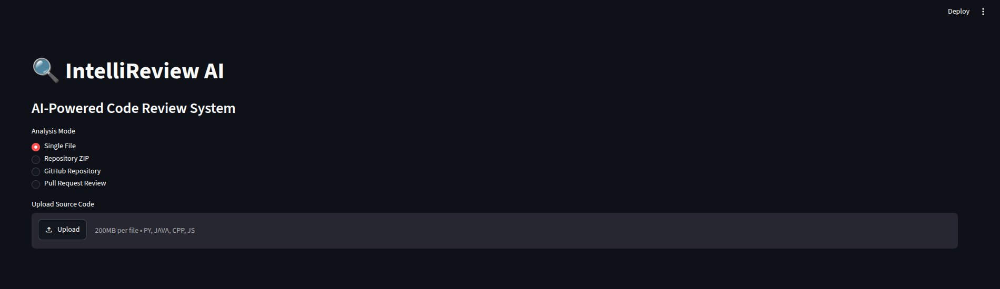
</p>

> Interactive Streamlit dashboard providing access to all supported analysis modes.

---

## Repository Overview

<p align="center">
    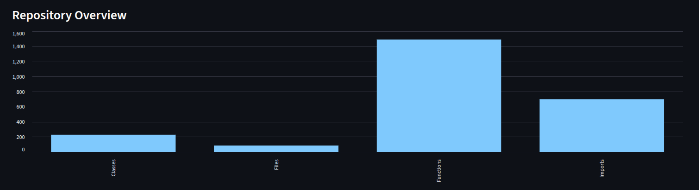
</p>

> High-level repository statistics including files, classes, functions, imports, complexity metrics, and repository health indicators.

---

## Repository Executive Summary

<p align="center">
    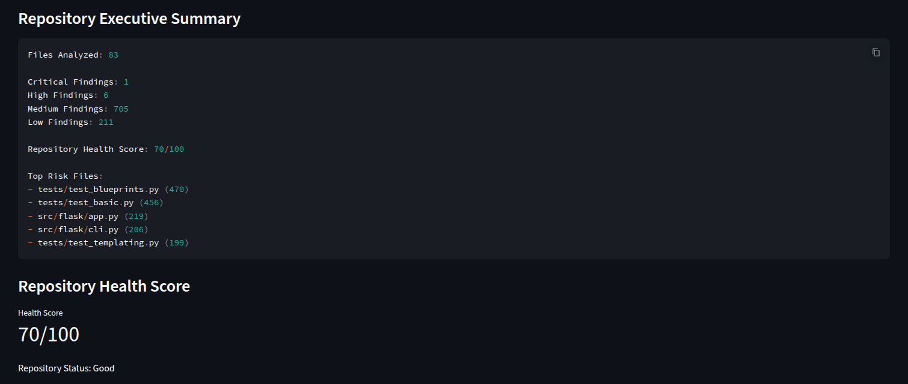
</p>

> AI-generated executive summary highlighting the overall condition of the repository and important engineering insights.

---

## Repository Summary

<p align="center">
    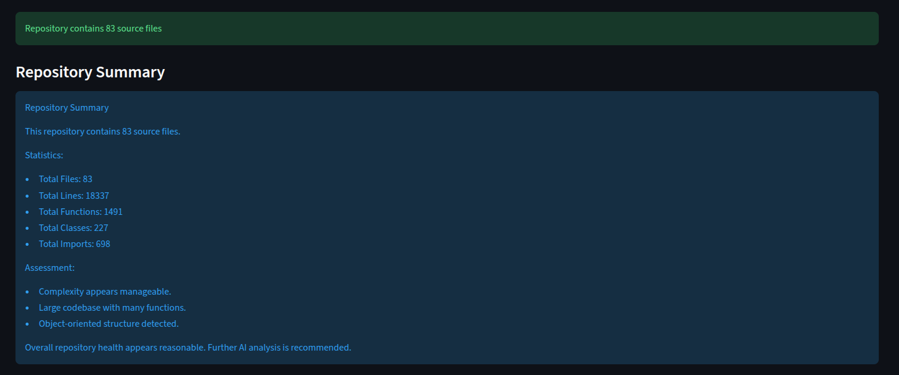
</p>

> Repository-level overview generated after analyzing the complete project.

---

## Dependency Graph

<p align="center">
    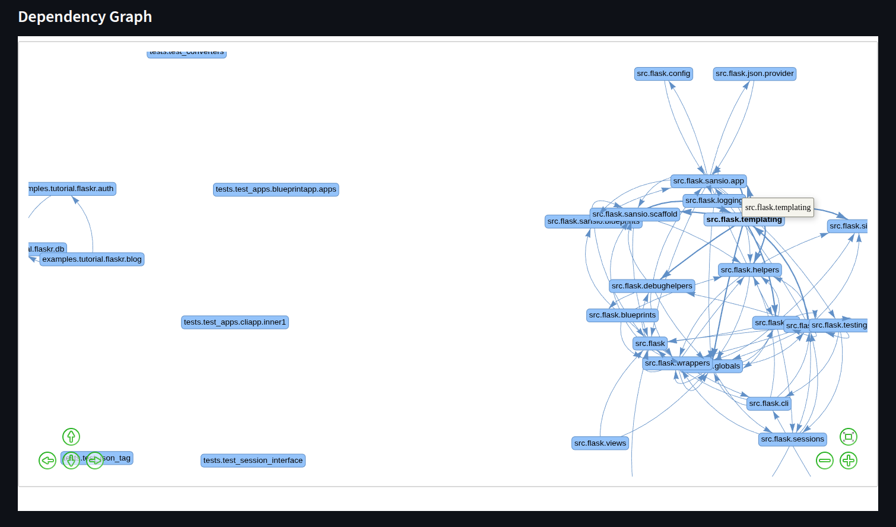
</p>

> Interactive dependency visualization showing relationships between project modules.

---

## Architecture Analysis

<p align="center">
    
</p>

> Repository architecture evaluation with architecture score and detected architectural issues.

---

## Technical Debt

<p align="center">
    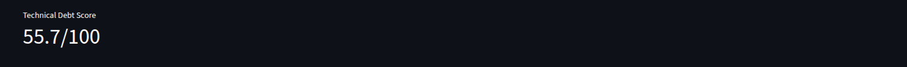
</p>

> Technical Debt Score used to estimate long-term maintainability and engineering quality.

---

## Repository Risk Ranking

<p align="center">
    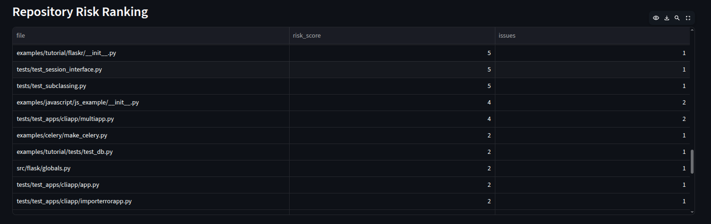
</p>

> Risk ranking identifies the most critical files requiring engineering attention.

---

## Security Dashboard

<p align="center">
    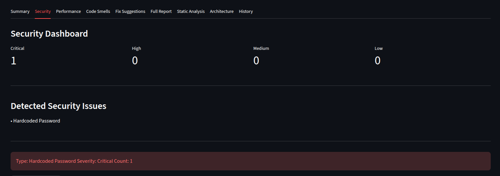
</p>

> Security findings categorized by severity with repository-wide vulnerability analysis.

---

## Severity Distribution

<p align="center">
    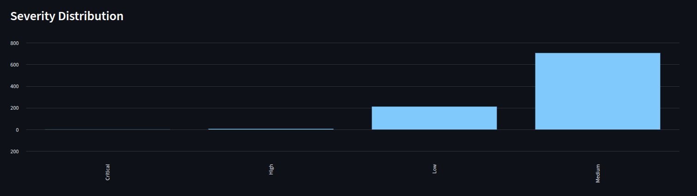
</p>

> Visual distribution of detected issues across Critical, High, Medium, and Low severity levels.

---

## Code Metrics

<p align="center">
    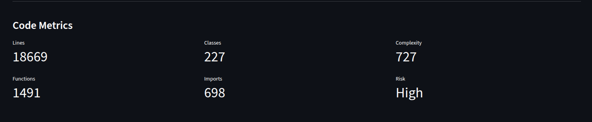
</p>

> Core software metrics including complexity, classes, functions, imports, and maintainability indicators.
---

# 🏗 System Architecture

IntelliReview AI follows a modular architecture that separates repository ingestion, analysis engines, AI reasoning, and report generation into independent components.

This modular design allows new analysis engines to be integrated without affecting the rest of the platform.

<p align="center">
    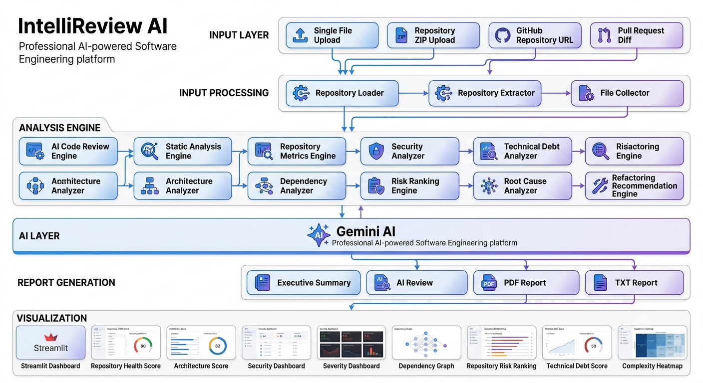
</p>

---

# ⚙ Engineering Analysis Pipeline

Every analysis follows a structured multi-stage pipeline that combines traditional software engineering techniques with AI-assisted reasoning.

<p align="center">
    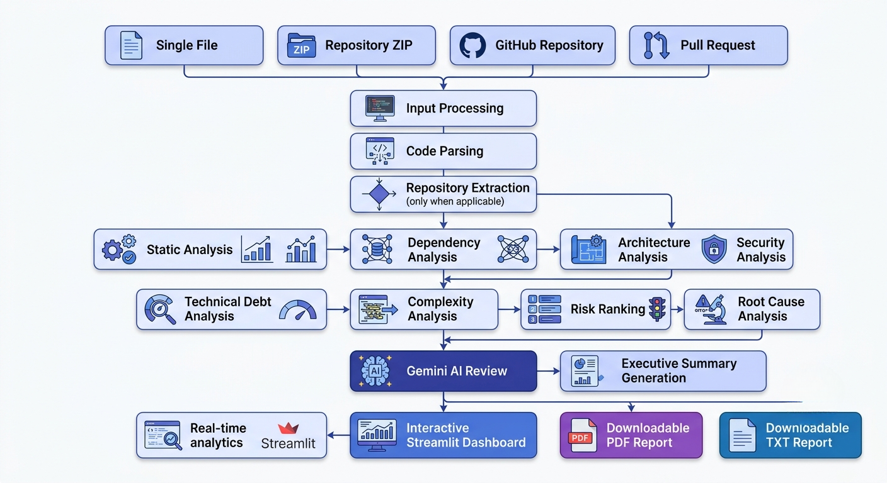
</p>

### Pipeline Stages

| Stage | Description |
|--------|-------------|
| Input | Accepts Single File, Repository ZIP, GitHub Repository, or Pull Request |
| Parsing | Loads and extracts source code |
| Static Analysis | Detects code quality issues and software smells |
| Repository Metrics | Computes repository-wide engineering metrics |
| Dependency Analysis | Builds module dependency relationships |
| Architecture Analysis | Detects architectural anti-patterns |
| Security Analysis | Identifies security vulnerabilities and exposed secrets |
| Technical Debt Analysis | Estimates maintainability and debt accumulation |
| Risk Ranking | Prioritizes high-risk modules and files |
| Root Cause Analysis | Groups findings into engineering causes |
| AI Review | Generates intelligent engineering insights using Gemini AI |
| Report Generation | Produces executive summaries and downloadable reports |

---

# 🔄 Developer Workflow

The platform is designed around a simple developer workflow.

<p align="center">
    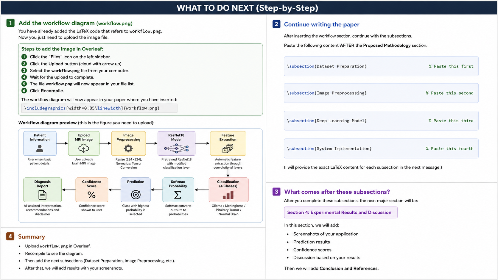
</p>

The complete workflow consists of:

1. Select an analysis mode.
2. Upload source code or connect a GitHub repository.
3. IntelliReview AI performs repository-wide analysis.
4. Engineering metrics and architectural insights are generated.
5. Gemini AI produces an executive engineering review.
6. Results are presented through interactive dashboards.
7. Reports can be exported as PDF or TXT for further review.

---

# 🧩 Modular Architecture

The project is organized into independent analysis modules.

| Module                  | Responsibility                        |
| ----------------------- | ------------------------------------- |
| Review Engine           | AI-powered code review orchestration  |
| AST Analyzer            | Static code analysis using Python AST |
| Repository Analyzer     | Repository-wide analysis pipeline     |
| Architecture Analyzer   | Architecture quality assessment       |
| Repository Metrics      | Repository metrics computation        |
| Technical Debt Engine   | Technical debt estimation             |
| Security Analyzer       | Secret detection & security analysis  |
| Dependency Analyzer     | Dependency graph generation           |
| File Risk Analyzer      | File-level engineering risk analysis  |
| Repository Risk Ranking | Repository-wide prioritization        |
| Executive Summary       | Engineering report generation         |
| PDF Generator           | Professional report export            |
| Streamlit UI            | Interactive dashboard                 |


---

# 🎯 Design Principles

The architecture of IntelliReview AI is built around the following principles:

- Modular engineering design
- Independent analysis engines
- AI-assisted reasoning
- Repository-wide intelligence
- Extensible plugin-style analyzers
- Human-readable engineering reports
- Separation of analysis, visualization, and reporting
- Scalable architecture for future enhancements
---

# 🛠 Technology Stack

## Core Technologies

| Category | Technologies |
|----------|--------------|
| Programming Language | Python 3.10+ |
| AI Model | Google Gemini API |
| Frontend | Streamlit |
| Static Analysis | Python AST + Custom Static Analysis Engine |
| Repository Analysis | Custom Repository Intelligence Engine |
| Dependency Analysis | NetworkX + PyVis |
| Data Processing | Pandas |
| Visualization | Streamlit + PyVis |
| Report Generation | ReportLab |
| Version Control | Git & GitHub |

---

## Engineering Capabilities

| Capability | Status |
|------------|--------|
| AI Code Review | ✅ |
| Static Analysis | ✅ |
| Repository Analysis | ✅ |
| GitHub Repository Support | ✅ |
| Repository ZIP Support | ✅ |
| Pull Request Review | ✅ |
| Architecture Analysis | ✅ |
| Dependency Graph | ✅ |
| Technical Debt Analysis | ✅ |
| Security Analysis | ✅ |
| Complexity Heatmap | ✅ |
| Root Cause Analysis | ✅ |
| Risk Ranking | ✅ |
| Executive Summary | ✅ |
| PDF Report Generation | ✅ |
| TXT Report Generation | ✅ |

---

# 📦 Installation

## 1. Clone Repository

```bash
git clone https://github.com/mansijoon/intellireview-ai

cd intellireview-ai
```

---

## 2. Create Virtual Environment

```bash
python -m venv venv
```

Linux / macOS

```bash
source venv/bin/activate
```

Windows

```powershell
venv\Scripts\activate
```

---

## 3. Install Dependencies

```bash
pip install -r requirements.txt
```

---

## 4. Configure Environment Variables

Create a `.env` file.

```env
GEMINI_API_KEY=YOUR_API_KEY
```

---

## 5. Run IntelliReview AI

```bash
streamlit run app.py
```

The application will automatically open in your browser.

---

# 🚀 Usage

## Option 1 — Single File Analysis

- Upload a supported source code file.
- Run AI review.
- View metrics, security analysis, and recommendations.

---

## Option 2 — Repository ZIP Analysis

- Upload a ZIP archive.
- IntelliReview AI extracts the repository.
- Repository-wide analysis begins automatically.

---

## Option 3 — GitHub Repository Analysis

- Paste a public GitHub repository URL.
- IntelliReview AI clones the repository.
- Complete repository analysis is performed.

---

## Option 4 — Pull Request Review

- Paste a pull request diff.
- Review incoming code before merging.
- Identify quality and security issues.

---

# 📄 Generated Reports

Every analysis may generate:

- Executive Summary
- AI Code Review
- Static Analysis Report
- Repository Metrics
- Security Dashboard
- Architecture Analysis
- Technical Debt Analysis
- Repository Health Score
- Dependency Analysis
- PDF Report
- TXT Report

---

# 📁 Supported File Types

| Input | Supported |
|--------|-----------|
| Python | ✅ |
| Java | ✅ |
| JavaScript | ✅ |
| C++ | ✅ |
| Repository ZIP | ✅ |
| GitHub Repository | ✅ |
| Pull Request Diff | ✅ |
---

# 🧠 Engineering Intelligence

IntelliReview AI transforms raw source code into actionable engineering insights by combining AI-assisted reasoning with repository-wide static analysis.

Instead of reporting isolated warnings, the platform evaluates software from multiple engineering perspectives and produces meaningful metrics that help developers understand the overall quality of a project.

---

# 📊 Repository Health Score

The Repository Health Score provides a high-level assessment of the overall quality and maintainability of a software repository.

It is computed using repository-wide engineering metrics including:

- Code complexity
- Repository structure
- Static analysis findings
- Architectural quality
- Technical debt indicators

This score enables developers to quickly assess the overall condition of a project before diving into detailed reports.

---

# 🏗 Architecture Score

The Architecture Score evaluates the structural quality of the repository.

Unlike traditional static analyzers that focus only on individual files, IntelliReview AI evaluates architectural patterns across the repository.

Current architectural analysis includes:

- God Module Detection
- Large Module Detection
- Repository Structure Analysis
- Architecture Findings

This provides an overview of how maintainable and scalable the software architecture is.

---

# 📈 Technical Debt Analysis

Technical debt measures the long-term maintenance cost introduced by design decisions and implementation choices.

The platform estimates technical debt using repository-level analysis and generates a Technical Debt Score that helps prioritize future engineering improvements.

---

# 🔗 Dependency Analysis

IntelliReview AI constructs an interactive dependency graph to visualize relationships between software modules.

Dependency analysis provides insights into:

- Internal module dependencies
- External library usage
- Highly coupled modules
- Critical dependency hubs

These insights help developers identify architectural bottlenecks and improve modularity.

---

# 🔒 Security Analysis

The platform automatically scans repositories for common security issues.

Examples include:

- Hardcoded credentials
- API keys
- Secret exposure
- Security-sensitive patterns

Detected issues are grouped by severity and presented through an interactive Security Dashboard.

---

# 📉 Complexity Analysis

Repository-wide complexity analysis helps identify code that is difficult to understand, maintain, or extend.

The analysis includes:

- Cyclomatic Complexity
- Complexity Heatmap
- High Complexity Modules
- Complexity Distribution

This enables developers to prioritize refactoring efforts.

---

# ⚠ Repository Risk Ranking

Not every file has the same engineering impact.

The Repository Risk Ranking identifies the files that require immediate attention based on multiple engineering signals including complexity, technical debt, architectural issues, and repository analysis.

This helps teams focus their effort where it has the greatest impact.

---

# 🧩 Root Cause Analysis

Instead of presenting isolated findings, IntelliReview AI groups related issues into engineering-level root causes.

This allows developers to understand *why* problems occur rather than simply listing warnings.

---

# 🔄 Refactoring Recommendations

Based on repository-wide analysis, IntelliReview AI generates refactoring priorities to help developers improve maintainability.

Recommendations are driven by:

- Technical Debt
- Complexity
- Risk Ranking
- Architecture Findings
- Dependency Analysis

---

# 🤖 AI-Assisted Engineering Review

Google Gemini AI is used to transform repository analysis into human-readable engineering reports.

The AI review includes:

- Repository Summary
- Executive Summary
- Engineering Recommendations
- Maintainability Insights
- Improvement Suggestions

The goal is to bridge the gap between raw analysis data and actionable engineering decisions.

---

# 📑 Executive Reporting

IntelliReview AI automatically generates professional reports suitable for documentation and engineering reviews.

Available outputs include:

- Executive Summary
- AI Review Report
- Repository Summary
- PDF Report
- TXT Report

These reports make it easier to communicate engineering insights across teams.
---

# 📂 Project Structure

IntelliReview AI follows a modular architecture centered around a dedicated engineering intelligence engine. Each analyzer is responsible for a specific aspect of repository evaluation, enabling the platform to combine multiple analyses into a unified engineering report.

```text
IntelliReview-AI/
│
├── analyzer/                          # Core engineering intelligence engine
│   ├── review_engine.py               # AI review orchestration
│   ├── ast_analyzer.py                # AST-based static analysis
│   ├── static_analysis.py             # Static analysis pipeline
│   ├── repository_analyzer.py         # Repository-wide orchestration
│   ├── architecture_analyzer.py       # Architecture analysis
│   ├── repository_metrics.py          # Repository metrics
│   ├── repository_health.py           # Repository health score
│   ├── technical_debt.py              # Technical debt analysis
│   ├── repository_security.py         # Security analysis
│   ├── secret_detector.py             # Secret detection
│   ├── duplicate_detector.py          # Duplicate code detection
│   ├── dead_function_detector.py      # Dead code detection
│   ├── file_risk_analyzer.py          # File-level risk analysis
│   ├── repository_risk_ranking.py     # Repository risk ranking
│   ├── executive_summary.py           # Executive reporting
│   ├── repository_summary.py          # Repository summary
│   ├── repository_summary_ai.py       # AI-generated insights
│   ├── pdf_generator.py               # PDF report generation
│   ├── dependency/                    # Dependency analysis
│   │   ├── builder.py
│   │   ├── graph.py
│   │   ├── visualizer.py
│   │   └── cycles.py
│   └── ...
│
├── lib/                               # Frontend visualization assets
├── reports/                           # Generated reports
├── sample_repo/                       # Example repository
├── tests/                             # Unit tests
│
├── app.py                             # Streamlit application
├── requirements.txt                   # Core dependencies
├── requirements_full.txt              # Extended dependencies
└── README.md
```

> **Note:** Some development and temporary files have been omitted from the structure above to emphasize the primary application architecture.

---

# 🏛 Engineering Modules

| Module | Responsibility |
|---------|----------------|
| Repository Analyzer | Coordinates repository-wide analysis workflow |
| Review Engine | Generates AI-powered code reviews |
| Static Analysis Engine | Detects code quality issues and software smells |
| Repository Metrics Engine | Computes repository-level metrics |
| Repository Health Engine | Calculates the Repository Health Score |
| Architecture Analyzer | Evaluates architectural quality and anti-patterns |
| Dependency Analyzer | Builds dependency graphs and identifies coupling |
| Security Analyzer | Detects secrets and security-sensitive patterns |
| Technical Debt Engine | Estimates maintainability debt |
| Risk Ranking Engine | Prioritizes high-risk files and modules |
| Executive Summary Engine | Produces repository summaries |
| PDF Generator | Generates exportable engineering reports |

---

# 🔄 Engineering Workflow

```text
User Input
     │
     ▼
Repository Acquisition
     │
     ▼
Source Code Parsing
     │
     ▼
Repository Analysis Engine
     │
     ├──────────── Static Analysis
     ├──────────── Architecture Analysis
     ├──────────── Dependency Analysis
     ├──────────── Security Analysis
     ├──────────── Repository Metrics
     ├──────────── Technical Debt
     ├──────────── Repository Health
     └──────────── Risk Ranking
                     │
                     ▼
            AI Engineering Review
                     │
                     ▼
Executive Summary + Interactive Dashboard + PDF Reports
```

---

# 🎯 Design Principles

IntelliReview AI is designed around the following principles:

- **Repository-first engineering intelligence**
- **Modular analysis architecture**
- **Independent analysis engines**
- **AI-assisted engineering reasoning**
- **Scalable repository analysis**
- **Reusable analysis components**
- **Separation of analysis, visualization, and reporting**
- **Extensible architecture for future analyzers**

---

# 🧪 Testing

The project includes an extensive suite of unit tests covering major analysis components.

Current coverage includes:

- Repository Analysis
- Static Analysis
- Architecture Analysis
- Security Detection
- Repository Metrics
- Repository Health
- Technical Debt
- Risk Ranking
- Dependency Analysis
- AI Review
- Executive Summary
- Pull Request Review
- Secret Detection
- PDF Report Generation
---

# 🤝 Contributing

Contributions are welcome and appreciated.

If you would like to contribute to IntelliReview AI:

1. Fork the repository.
2. Create a feature branch.
3. Make your changes.
4. Commit with clear and descriptive messages.
5. Submit a Pull Request.

For significant feature additions or architectural changes, please open an issue first to discuss the proposed implementation.

---

# 📜 License

This project is licensed under the MIT License.

See the `LICENSE` file for more information.

---

# 🙏 Acknowledgements

IntelliReview AI is built using several open-source technologies, including:

- Python
- Streamlit
- Google Gemini API
- NetworkX
- PyVis
- Pandas
- ReportLab

The project also draws inspiration from modern software engineering and repository intelligence platforms that emphasize maintainability, architecture analysis, and developer productivity.

---

# ⚠ Disclaimer

IntelliReview AI provides automated repository analysis and AI-assisted engineering recommendations.

The generated analysis, scores, and recommendations are intended to assist developers and should not be considered a substitute for manual code reviews or professional engineering judgment.

This software is provided **"AS IS"**, without warranty of any kind, under the terms of the MIT License.

---

# ⭐ Support the Project

If you find IntelliReview AI useful, consider:

- ⭐ Starring the repository
- 🐞 Reporting bugs
- 💡 Suggesting new features
- 🔀 Contributing improvements

Your support helps improve the project and encourages future development.

---

# 📬 Contact

For bug reports, feature requests, or discussions, please use the GitHub Issues section of this repository.

If you would like to contribute, feel free to submit a Pull Request.

---

<div align="center">

# IntelliReview AI

### AI-Powered Engineering Intelligence Platform

Transforming repository analysis into actionable engineering insights.

**If you found this project valuable, consider giving it a ⭐ on GitHub.**

</div>
