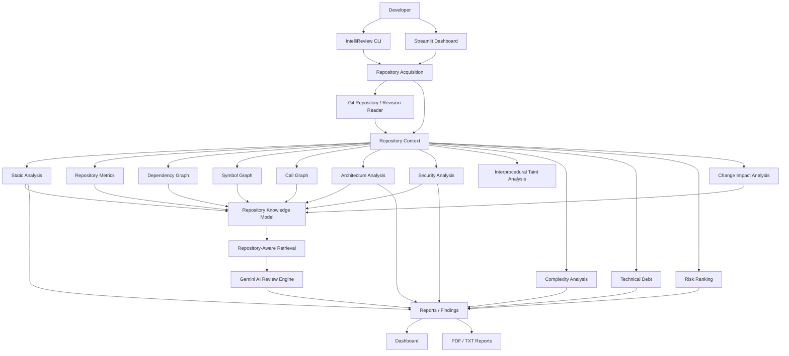

# IntelliReview AI

## AI-Powered Engineering Intelligence Platform

IntelliReview AI is a repository-scale code intelligence and AI-assisted code review platform that combines deterministic static analysis, software architecture analysis, dependency and code-relationship graphs, security analysis, repository-aware retrieval, Git-aware change analysis, and Google Gemini-powered engineering reasoning.

The platform is designed to analyze software at both the **individual-file** and **repository** level and turn source code into structured engineering findings, risk assessments, recommendations, and reports.

---

# Overview

Traditional code-review tools often focus on isolated files, linting rules, or individual warnings.

IntelliReview AI takes a repository-oriented approach.

It builds a structured representation of the codebase and combines multiple analysis layers:

```text
Source Code
    │
    ▼
Repository Loader
    │
    ▼
Repository Context
    │
    ├── AST / Static Analysis
    ├── Repository Metrics
    ├── Dependency Graph
    ├── Symbol Graph
    ├── Call Graph
    ├── Architecture Analysis
    ├── Security Analysis
    ├── Complexity Analysis
    ├── Technical Debt
    ├── File Risk Analysis
    └── Change Impact Analysis
             │
             ▼
    Repository Knowledge Model
             │
             ▼
    Repository-Aware Retrieval
             │
             ▼
       AI Review Engine
             │
             ▼
    Engineering Findings
             │
             ├── Dashboard
             ├── Executive Summary
             ├── Recommendations
             ├── PDF Report
             └── TXT Report
```

The result is an engineering-intelligence workflow rather than a simple LLM wrapper around source code.

---

# Supported Analysis Modes

IntelliReview AI supports four primary analysis workflows.

| Mode | Description |
|---|---|
| Single File Analysis | Analyze an individual source file using deterministic analysis and AI-assisted review |
| Repository ZIP Analysis | Analyze an uploaded repository archive |
| GitHub Repository Analysis | Clone and analyze a public GitHub repository |
| Pull Request Review | Analyze incoming changes and review pull-request code |

The same underlying analysis infrastructure is reused across these workflows.

---

# Core Capabilities

- AI-assisted code review
- Repository-scale static analysis
- Repository health assessment
- Architecture analysis
- Dependency graph generation
- Symbol graph construction
- Call graph construction
- Change-impact analysis
- Security vulnerability detection
- Interprocedural taint analysis
- Complexity analysis
- Technical-debt analysis
- File-level risk analysis
- Repository risk ranking
- Repository-aware retrieval
- Git revision analysis
- Pull-request review
- GitHub integration
- Incremental analysis and cache reuse
- Executive engineering summaries
- PDF report generation
- TXT report generation
- Interactive Streamlit dashboard
- CLI-based repository analysis
- Automated tests
- GitHub Actions quality gates

---

# Architecture


```mermaid
flowchart TD
    USER["Developer"]

    CLI["IntelliReview CLI"]
    UI["Streamlit Dashboard"]

    ACQ["Repository Acquisition"]
    GIT["Git Repository / Revision Reader"]
    CONTEXT["Repository Context"]

    STATIC["Static Analysis"]
    METRICS["Repository Metrics"]
    DEP["Dependency Graph"]
    SYMBOL["Symbol Graph"]
    CALL["Call Graph"]
    ARCH["Architecture Analysis"]
    SEC["Security Analysis"]
    TAINT["Interprocedural Taint Analysis"]
    COMPLEX["Complexity Analysis"]
    DEBT["Technical Debt"]
    RISK["Risk Ranking"]
    IMPACT["Change Impact Analysis"]

    KNOWLEDGE["Repository Knowledge Model"]
    RETRIEVAL["Repository-Aware Retrieval"]
    AI["Gemini AI Review Engine"]

    REPORT["Reports / Findings"]
    DASH["Dashboard"]
    PDF["PDF / TXT Reports"]

    USER --> CLI
    USER --> UI

    CLI --> ACQ
    UI --> ACQ

    ACQ --> GIT
    ACQ --> CONTEXT
    GIT --> CONTEXT

    CONTEXT --> STATIC
    CONTEXT --> METRICS
    CONTEXT --> DEP
    CONTEXT --> SYMBOL
    CONTEXT --> CALL
    CONTEXT --> ARCH
    CONTEXT --> SEC
    CONTEXT --> TAINT
    CONTEXT --> COMPLEX
    CONTEXT --> DEBT
    CONTEXT --> RISK
    CONTEXT --> IMPACT

    DEP --> KNOWLEDGE
    SYMBOL --> KNOWLEDGE
    CALL --> KNOWLEDGE
    STATIC --> KNOWLEDGE
    METRICS --> KNOWLEDGE
    ARCH --> KNOWLEDGE
    SEC --> KNOWLEDGE
    IMPACT --> KNOWLEDGE

    KNOWLEDGE --> RETRIEVAL
    RETRIEVAL --> AI

    STATIC --> REPORT
    ARCH --> REPORT
    SEC --> REPORT
    COMPLEX --> REPORT
    DEBT --> REPORT
    RISK --> REPORT
    AI --> REPORT

    REPORT --> DASH
    REPORT --> PDF
```

---

# Repository Analysis Pipeline

The repository analysis pipeline is built around a shared `RepositoryContext`.

```text
Repository
    │
    ▼
Repository Acquisition
    │
    ▼
File Discovery
    │
    ▼
Source Metadata
    │
    ▼
RepositoryContext
    │
    ├── Source Files
    ├── Content Hashes
    ├── AST Context
    ├── Repository Artifacts
    └── Analysis Configuration
```

The context provides a common representation of the repository to downstream analyzers.

This avoids forcing each analyzer to independently rediscover and parse repository information.

---

# 1. Repository Acquisition

IntelliReview AI can acquire source code from multiple inputs.

### Supported sources

- Local source repositories
- ZIP archives
- Public GitHub repositories
- Git repositories
- Pull-request changes

Repository acquisition is separated from analysis so that the same analysis engine can operate on different input sources.

---

# 2. Exact Git Revision Analysis

The platform includes Git-aware repository handling.

The Git repository layer can:

- Resolve Git revisions to commit SHA values
- Read files from exact committed trees
- Enumerate files at a revision
- Access committed source without modifying the working tree

This enables analysis against a specific repository revision rather than relying exclusively on the current filesystem state.

```text
Git Revision
     │
     ▼
Commit
     │
     ▼
Committed Tree
     │
     ▼
RepositoryContext
```

This provides deterministic inputs for Git-aware analysis workflows.

---

# 3. Static Analysis Engine

The static-analysis layer performs deterministic source-code analysis.

It is designed to identify engineering issues without depending on an LLM.

Analysis includes areas such as:

- Code-quality findings
- Engineering-rule violations
- Complexity
- Dead code
- Structural issues
- Maintainability signals
- Source-level diagnostics

Deterministic analysis provides reproducible findings that can be combined with AI-generated reasoning.

---

# 4. AST-Based Analysis

Python source is parsed using the Python AST.

The AST representation is reused by multiple analyzers rather than reparsing source independently.

This enables analysis of:

- Functions
- Classes
- Imports
- Calls
- Assignments
- Parameters
- Expressions
- Control-flow-related structures
- Source locations

Each finding can retain source-location information so that issues can be associated with concrete repository locations.

---

# 5. Repository Metrics

The repository metrics engine computes repository-level engineering measurements.

Examples include:

- Lines of code
- File counts
- Complexity
- Import relationships
- Structural statistics
- Module-level measurements
- Repository-level summaries

These metrics feed higher-level systems such as repository health, risk ranking, and technical-debt analysis.

---

# 6. Dependency Graph

IntelliReview AI constructs a repository dependency graph.

The dependency model captures relationships between modules and files.

It supports analysis of:

- Internal dependencies
- External dependencies
- Dependency relationships
- Highly depended-on modules
- Highly dependent modules
- Dependency cycles
- Coupling patterns

The graph provides structural information that cannot be obtained reliably from isolated file analysis.

---

# 7. Symbol Graph

The platform also builds a symbol graph representing relationships between source-level symbols.

The symbol graph can be used to reason about:

- Functions
- Classes
- Methods
- Symbol definitions
- Symbol references
- Cross-module relationships

The symbol graph is shared with other repository-level analyzers.

---

# 8. Call Graph

The call graph models relationships between callable symbols.

```text
Caller
   │
   ▼
Callee
```

The graph enables higher-level analyses such as:

- Call relationships
- Change propagation
- Interprocedural security analysis
- Change-impact analysis

Call relationships are resolved using repository-level symbol and dependency information.

---

# 9. Change Impact Analysis

One of the core repository-intelligence capabilities is change-impact analysis.

Given changed modules or symbols, IntelliReview AI can use repository graphs to determine affected components.

```text
Changed Module
      │
      ▼
Dependency Graph
      │
      ▼
Impacted Modules
      │
      ├── Symbol Impact
      │
      └── Call Impact
```

The system calculates direct and transitive impact across:

- Modules
- Symbols
- Calls

This provides a foundation for granular incremental analysis and Git-aware review.

---

# 10. Incremental Analysis

The analysis architecture includes dependency-aware incremental processing.

Rather than treating every repository modification as a reason to discard all previous analysis, IntelliReview AI maintains cached analysis results and determines which work can be reused.

The cache system tracks analysis state using repository and file-level information.

Conceptually:

```text
Repository
    │
    ├── Unchanged Files ───────> Reuse Cached Results
    │
    └── Changed Files
            │
            ▼
       Impact Analysis
            │
            ▼
     Recompute Affected Work
```

This architecture is intended to reduce unnecessary recomputation as repositories evolve.

The repository contains dedicated benchmark tooling for measuring:

- Cold analysis
- Warm analysis
- Cache hits and misses
- Analyzer reuse
- Recomputed analyzers
- Single-file change impact
- Incremental work reduction

---

# 11. Repository Knowledge Model

The analysis engines produce structured artifacts that can be reused by later stages.

The repository knowledge model can incorporate:

- Static-analysis findings
- Dependency relationships
- Symbols
- Calls
- Architecture information
- Security findings
- Repository metrics
- Change-impact information

This provides a shared knowledge layer between deterministic analysis and AI-assisted reasoning.

---

# 12. Repository-Aware Retrieval

Instead of sending an entire repository directly to the LLM, IntelliReview AI can select relevant repository context for a review.

The retrieval workflow is conceptually:

```text
Repository Knowledge
       │
       ▼
Review Query
       │
       ▼
Relevant Documents
       │
       ▼
Repository Context Selection
       │
       ▼
Context Formatting
       │
       ▼
AI Review
```

The retrieval layer ranks repository documents against a review query and selects relevant context subject to configured limits.

This reduces unnecessary repository context and makes AI review more targeted.

The repository includes benchmark tooling for measuring repository-context reduction and estimated LLM token reduction.

---

# 13. AI Review Engine

Google Gemini is used for AI-assisted engineering reasoning.

The AI layer is positioned downstream of deterministic repository analysis rather than replacing it.

The AI review system can produce:

- Code-review findings
- Engineering explanations
- Repository-level insights
- Recommendations
- Executive summaries
- Maintainability observations
- Architecture observations
- Refactoring suggestions

The architecture therefore separates:

```text
Deterministic Evidence
        +
Repository Context
        +
AI Reasoning
        =
Engineering Review
```

This separation makes it possible to preserve deterministic analysis while using AI for higher-level interpretation and recommendations.

---

# 14. Security Analysis

Security analysis is implemented as a dedicated analysis subsystem.

Current capabilities include detection of patterns such as:

- Hardcoded credentials
- API keys
- Secret exposure
- Security-sensitive operations
- Unsafe coding patterns

The system also contains an interprocedural taint-analysis component.

---

# 15. Interprocedural Taint Analysis

The taint engine tracks potentially unsafe data across function boundaries.

Conceptually:

```text
Taint Source
     │
     ▼
Caller
     │
     ▼
Function Argument
     │
     ▼
Callee Parameter
     │
     ▼
Security-Sensitive Sink
```

The implementation uses repository-level:

- Symbol graph
- Call graph
- Function parameters
- Source identification
- Sink identification
- Taint propagation

Findings can include source, sink, location, severity, confidence, and remediation information.

This moves security analysis beyond simple string matching into repository-aware data-flow reasoning.

---

# 16. Architecture Analysis

The architecture analyzer evaluates repository structure and architectural quality.

Current analysis includes areas such as:

- Repository structure
- Large-module detection
- God-module detection
- Architectural findings
- Module organization

The architecture analysis is repository-level rather than limited to isolated files.

---

# 17. Complexity Analysis

The platform analyzes code complexity to identify areas that may require additional maintenance or refactoring effort.

Current capabilities include:

- Cyclomatic complexity
- Complexity distributions
- Complexity heatmaps
- High-complexity modules
- Complexity-related findings

Complexity measurements also contribute to repository-level risk and health analysis.

---

# 18. Technical Debt Analysis

IntelliReview AI estimates technical debt using repository-level engineering signals.

Technical-debt analysis can incorporate:

- Static-analysis findings
- Complexity
- Structural issues
- Maintainability indicators
- Architectural findings

The output is presented as part of the broader repository engineering assessment.

---

# 19. File Risk Analysis

Not every file presents the same engineering risk.

The file-risk subsystem evaluates files using multiple engineering signals.

Risk inputs can include:

- Complexity
- File size
- Coupling
- Static-analysis findings
- Architectural issues
- Technical-debt indicators

The resulting information feeds repository risk ranking.

---

# 20. Repository Risk Ranking

The repository risk-ranking layer prioritizes areas of the codebase that warrant attention.

Instead of presenting every finding with equal importance, the system combines multiple engineering signals to identify higher-risk repository components.

This allows developers to move from:

```text
Hundreds of possible observations
             │
             ▼
       Risk prioritization
             │
             ▼
      Actionable focus areas
```

---

# 21. Repository Health

The Repository Health Score provides a high-level view of repository quality.

It combines repository-wide engineering signals including:

- Code complexity
- Repository structure
- Static-analysis findings
- Architectural quality
- Technical-debt indicators

The health score is intended as a summary layer over the underlying engineering measurements rather than a replacement for them.

---

# 22. Executive Engineering Summary

The platform generates higher-level summaries intended for developers, reviewers, and engineering stakeholders.

The executive-summary layer can consolidate:

- Major findings
- Engineering risks
- Repository health
- Architecture observations
- Security observations
- Maintainability concerns
- Recommended improvements

---

# 23. Pull Request Review

Pull-request analysis allows incoming changes to be reviewed before merging.

The workflow can analyze:

- Pull-request diffs
- Changed source files
- Engineering findings
- Security findings
- Relevant repository context

GitHub integration includes functionality for retrieving pull-request information and creating review comments associated with changed files and lines.

```text
Pull Request
      │
      ▼
Changed Files / Diff
      │
      ▼
Repository Analysis
      │
      ▼
Relevant Findings
      │
      ▼
GitHub Review Comments
```

This connects repository intelligence directly to the software-development workflow.

---

# 24. GitHub Integration

The GitHub integration supports repository and pull-request workflows.

Capabilities include:

- Repository cloning
- Pull-request file retrieval
- Pull-request analysis
- Review-comment creation
- Commit-aware review context

The integration is designed to connect IntelliReview AI with GitHub-based development workflows.

---

# 25. CLI

IntelliReview AI includes a command-line interface for programmatic analysis.

The CLI supports repository analysis workflows without requiring the Streamlit interface.

Example conceptual workflow:

```text
Developer
    │
    ▼
intellireview
    │
    ▼
Repository Analysis
    │
    ▼
Structured Results
```

The CLI is also used by automated CI workflows.

---

# 26. Streamlit Dashboard

The Streamlit application provides an interactive interface for the analysis engine.

The dashboard presents analysis results across multiple views, including:

- Code review
- Security findings
- Performance / complexity information
- Code smells
- AI fix suggestions
- Static analysis
- Architecture analysis
- Historical comparison

Repository-level metrics are surfaced through interactive dashboards and summaries.

---

# 27. Generated Reports

IntelliReview AI can generate structured engineering reports.

### Available outputs

- AI code review
- Executive summary
- Static-analysis report
- Repository metrics
- Security dashboard
- Architecture analysis
- Technical-debt analysis
- Repository health assessment
- Dependency analysis
- PDF report
- TXT report

The reporting layer separates analysis results from their presentation format.

---

# 28. Historical Comparison

The dashboard includes historical comparison capabilities.

The system can compare repository analysis results and expose:

- Previous score
- Current score
- Difference
- Comparison status

This provides a foundation for tracking engineering quality across successive analysis runs.

---

# 29. Supported Source Types

The project currently supports analysis workflows for:

| Input | Support |
|---|---|
| Python | Yes |
| Java | Yes |
| JavaScript | Yes |
| C++ | Yes |
| Repository ZIP | Yes |
| GitHub Repository | Yes |
| Pull Request Diff | Yes |

The underlying architecture is designed around extensible analyzers and repository abstractions rather than a single-language analysis path.

---

# Engineering Architecture

The project is organized into several major layers.

```text
IntelliReview AI
│
├── Interface Layer
│   ├── Streamlit Dashboard
│   └── CLI
│
├── Acquisition Layer
│   ├── Local Repository
│   ├── ZIP Repository
│   ├── Git Repository
│   └── GitHub Integration
│
├── Repository Intelligence Layer
│   ├── Repository Context
│   ├── Source Metadata
│   ├── AST Context
│   ├── Dependency Graph
│   ├── Symbol Graph
│   └── Call Graph
│
├── Analysis Layer
│   ├── Static Analysis
│   ├── Architecture
│   ├── Security
│   ├── Taint Analysis
│   ├── Complexity
│   ├── Technical Debt
│   ├── File Risk
│   ├── Risk Ranking
│   └── Change Impact
│
├── Knowledge Layer
│   ├── Analysis Artifacts
│   ├── Repository Knowledge
│   ├── Retrieval
│   └── Context Selection
│
├── AI Layer
│   ├── Gemini Review
│   ├── Recommendations
│   └── Executive Summaries
│
└── Reporting Layer
    ├── Dashboard
    ├── PDF
    └── TXT
```

---

# Performance & Incremental Analysis

The project contains dedicated benchmark tooling rather than relying solely on theoretical performance claims.

The benchmark infrastructure measures:

### Incremental analysis

- Cold repository analysis
- Warm repository analysis
- Analyzer recomputation
- Analyzer reuse
- File-cache hits
- File-cache misses
- Changed-file analysis

### Repository-context optimization

- Full repository context size
- Selected repository context size
- Context reduction
- Context retention

### LLM prompt optimization

- Baseline prompt size
- Repository-context size
- Selected-context size
- Estimated token counts
- Token-reduction calculations

These benchmarks are designed to quantify the engineering impact of repository-aware caching and retrieval.

---

# Testing

The project contains a substantial automated test suite spanning the major analysis subsystems.

Testing covers areas including:

- Repository loading
- Repository context
- Static analysis
- Complexity analysis
- Architecture analysis
- Security analysis
- Secret detection
- Taint analysis
- Dependency graphs
- Symbol graphs
- Call graphs
- Change-impact analysis
- Incremental analysis
- Repository caching
- Git integration
- GitHub integration
- Pull-request workflows
- AI review
- Executive summaries
- Report generation

The C++/Java/Python/JavaScript sample repositories and fixtures used by the project also provide controlled inputs for analysis and integration testing.

---

# CI / Quality Gates

IntelliReview AI includes a GitHub Actions workflow triggered on:

- Pushes to `main`
- Pull requests

The CI workflow performs:

```text
Checkout
   │
   ▼
Python Environment
   │
   ▼
Dependency Installation
   │
   ▼
Deterministic Test Suite
   │
   ▼
Repository Analysis
   │
   ▼
JSON Results
   │
   ▼
Quality Gate
```

The quality gate verifies that:

- The analysis completed successfully
- The expected analyzers completed successfully

This makes IntelliReview itself capable of being used as an automated repository-quality check.

---

# Quality Gate Architecture

The CI quality gate consumes structured JSON analysis results rather than relying on human interpretation.

Conceptually:

```text
Repository
    │
    ▼
IntelliReview CLI
    │
    ▼
JSON Analysis Result
    │
    ▼
Quality Gate
    │
    ├── Analysis Failed → CI Failure
    │
    └── Analysis Passed → CI Success
```

This provides a deterministic integration point between repository analysis and CI.

---

# Technology Stack

| Layer | Technology |
|---|---|
| Language | Python |
| UI | Streamlit |
| AI | Google Gemini |
| Parsing | Python AST |
| Version Control | Git / GitPython |
| GitHub Integration | GitHub API integration |
| Data Processing | Python standard library + project analysis modules |
| Testing | pytest |
| CLI | Python CLI package |
| Reporting | PDF / TXT generation |
| CI | GitHub Actions |
| Repository Cache | Custom analysis cache |
| Graph Models | Dependency / Symbol / Call Graphs |

---

# Repository Structure

```text
IntelliReview/
│
├── analyzer/
│   ├── core/
│   │   ├── repository_context.py
│   │   ├── git_repository.py
│   │   ├── cache.py
│   │   └── models.py
│   │
│   ├── dependency/
│   │   ├── builder.py
│   │   ├── graph.py
│   │   ├── cycles.py
│   │   └── visualizer.py
│   │
│   ├── symbol/
│   │   └── ...
│   │
│   ├── call/
│   │   └── ...
│   │
│   ├── architecture/
│   │   └── ...
│   │
│   ├── security/
│   │   └── ...
│   │
│   ├── taint/
│   │   └── ...
│   │
│   ├── complexity/
│   │   └── ...
│   │
│   ├── technical_debt/
│   │   └── ...
│   │
│   ├── risk/
│   │   └── ...
│   │
│   ├── impact/
│   │   └── ...
│   │
│   ├── repository/
│   │   └── ...
│   │
│   └── ...
│
├── intellireview_cli/
│   └── ...
│
├── github/
│   └── ...
│
├── tests/
│   ├── fixtures/
│   ├── test_*.py
│   └── ...
│
├── sample_repo/
│
├── assets/
│   └── images/
│
├── reports/
│
├── app.py
├── requirements.txt
├── pyproject.toml
└── README.md
```

---

# Engineering Principles

## Deterministic analysis before AI reasoning

The platform does not depend exclusively on an LLM to discover engineering facts.

Deterministic analyzers produce structured evidence first.

AI is then used for higher-level reasoning and explanation.

---

## Repository-scale reasoning

The system treats a repository as a connected software system rather than a collection of unrelated files.

Dependency, symbol, and call relationships allow findings to be interpreted in repository context.

---

## Reusable analysis artifacts

Expensive intermediate representations such as:

- Dependency graphs
- Symbol graphs
- Call graphs
- AST contexts
- Cached analyzer results

can be reused by multiple downstream analyzers.

---

## Incremental computation

The analysis cache and change-impact model are designed to avoid unnecessary recomputation when only a subset of a repository changes.

---

## Separation of concerns

The project separates:

```text
Acquisition
    ↓
Repository Modeling
    ↓
Analysis
    ↓
Knowledge / Retrieval
    ↓
AI Reasoning
    ↓
Reporting
    ↓
Presentation
```

This keeps the analysis engine independent from the user interface and reporting layers.

---

# Engineering Concepts Demonstrated

### AI Engineering

- Repository-aware RAG
- Context selection
- Token-budget optimization
- Structured AI review
- AI-assisted engineering reasoning

### Algorithms & Code Intelligence

- AST analysis
- Dependency graphs
- Symbol graphs
- Call graphs
- Graph traversal
- Change-impact analysis
- Interprocedural taint analysis
- Incremental invalidation
- Cache reuse

### Developer Infrastructure

- CLI tooling
- Git integration
- GitHub integration
- Pull-request review
- CI integration
- Automated quality gates
- Structured machine-readable results

### Software Engineering

- Modular architecture
- Repository-wide analysis
- Static analysis
- Architecture analysis
- Security analysis
- Complexity analysis
- Technical-debt analysis
- Risk prioritization

### Testing & Reliability

- Unit testing
- Integration testing
- Fixture-driven analysis
- Git/GitHub integration tests
- Incremental-analysis tests
- CI validation

---

# What Makes the Architecture Different

The central design decision is to avoid treating AI as the entire product.

Instead:

```text
             ┌─────────────────────┐
             │    Source Code      │
             └──────────┬──────────┘
                        │
                        ▼
             ┌─────────────────────┐
             │ Deterministic       │
             │ Repository Analysis │
             └──────────┬──────────┘
                        │
          ┌─────────────┼─────────────┐
          │             │             │
          ▼             ▼             ▼
      Dependency      Symbol        Call
        Graph         Graph        Graph
          │             │             │
          └─────────────┼─────────────┘
                        │
                        ▼
             ┌─────────────────────┐
             │ Repository          │
             │ Knowledge Model     │
             └──────────┬──────────┘
                        │
                        ▼
             ┌─────────────────────┐
             │ Context Retrieval   │
             └──────────┬──────────┘
                        │
                        ▼
             ┌─────────────────────┐
             │ Gemini AI Reasoning │
             └──────────┬──────────┘
                        │
                        ▼
             ┌─────────────────────┐
             │ Engineering Output  │
             └─────────────────────┘
```

This architecture combines deterministic software analysis with probabilistic AI reasoning while keeping the two responsibilities distinct.

---

# Current Implementation Scope

IntelliReview AI currently provides:

- Multi-mode source-code analysis
- Repository-scale analysis
- Static analysis
- Architecture analysis
- Security analysis
- Dependency analysis
- Symbol analysis
- Call analysis
- Change-impact analysis
- Incremental analysis
- Repository-aware retrieval
- AI-assisted code review
- Git revision analysis
- GitHub repository analysis
- Pull-request review
- CI quality gates
- Repository health analysis
- Risk ranking
- Technical-debt analysis
- Complexity analysis
- Executive reporting
- PDF/TXT reports
- Streamlit visualization
- CLI-based execution

---

# What IntelliReview AI Is Not

IntelliReview AI is an engineering-analysis and code-intelligence platform.

It is not intended to replace:

- Human code review
- Security penetration testing
- Formal verification
- Production incident investigation
- Organization-specific engineering judgment
- Full language-server functionality
- A production security scanner for every possible vulnerability class

AI-generated recommendations should be treated as engineering assistance and validated against the underlying source code.

---

# Summary

IntelliReview AI combines repository-scale software analysis with AI-assisted engineering reasoning.

Its core architecture is:

```text
Repository
    ↓
Repository Context
    ↓
Static Analysis
    +
Dependency Graph
    +
Symbol Graph
    +
Call Graph
    +
Architecture Analysis
    +
Security / Taint Analysis
    +
Complexity / Technical Debt
    +
Change Impact
    ↓
Repository Knowledge
    ↓
Relevant Context Retrieval
    ↓
Gemini AI Review
    ↓
Engineering Findings
    ↓
Dashboard / Reports / CI
```

The project demonstrates engineering across:

```text
Algorithms
     +
Static Analysis
     +
Graph Modeling
     +
Developer Infrastructure
     +
AI Engineering
     +
Security Analysis
     +
Git / GitHub Integration
     +
CI/CD
     +
Testing
     +
Reporting
```

IntelliReview AI is built as a repository intelligence system rather than a simple AI code-review interface, with deterministic analysis, reusable code-relationship models, incremental computation, repository-aware retrieval, and AI-assisted reasoning forming the core architecture.
